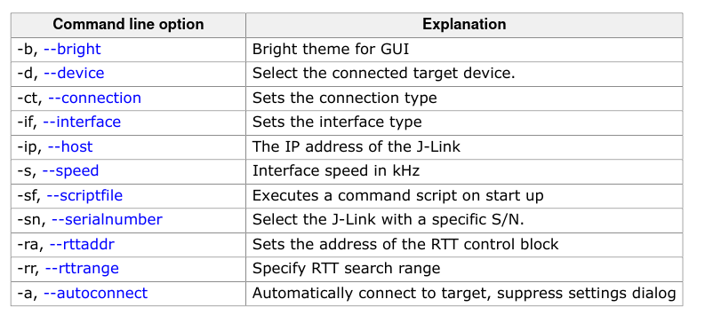

# Viable Ideas

## Bare Bone Ideas

Ideas that haven't gone through preliminary research:

## Learn Rust by writing a command line application for JLink RTT Viewer

[JLink RTT Viewer](1) is a debugging technology by Segger that is touted to be faster than most of the market.

The easiest way would have been to use the JLink SDK which contains client code but it costs a lot of money. The most viable way then is to use telnet like JLinkRTTClient does(although it can only see channel 0).

To have the telnet server running, would need the `JLinkRTTViewer` to run, but preferably it should run without a GUI. To do that:

```shell
# need to install Xvfb, an x-window buffer implementation
Xvfb :18& # create display 18, there maybe some warnings but that's okay
export DISPLAY=:18 # change display being used to 18

JLinkRTTViewer --autoconnect& # autoconnect to skip the selection screen
telnet localhost 19021
```

JLinkRTTViewer command line option:



The JLinkRTTViewer's feature set is pretty bare-bone, it allows for viewing(with color support), sending data and logging to file. One good idea is to incorporate it with other apps like:

- JLinkSWOViewer
- JLinkConfig
- JLinkExe

[1]: https://www.segger.com/products/debug-probes/j-link/technology/about-real-time-transfer/
