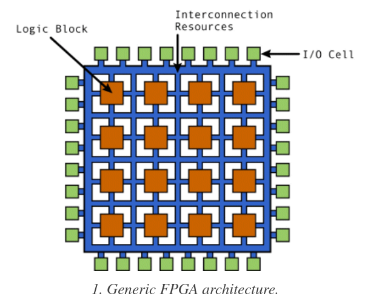

# FPGA

## Terms That Is Forgotten A Lot

- Combinatorial Logic: Where two or more input defines one output. This can be like addition where c = a + b.

## FPGA Components

FPGAs are made of blocks and connected together by programmable routes.

- Logic block: Contains logic components like multiplexer(for routing between other components), flip flops(storage based on clock signal), RAM(for look up table, aka truth table).
- IO Block: Connect logic blocks with external components. Handle things like like slew rate, active high/low, pull-ups, pull-down, etc.
- Interconnect: The programmable routes(in the form of matrix), there are short lines for blocks closed together and long lines for blocks far from each other. There are global clock lines that are connected to the logic block clock lines to distribute clock. They are the FPGA fabric.

Types of Cores:

- Soft Cores: Mainly implemented using HDL code.
- Hard Cores: Actual physical cores surrounded by programmable logic on the chip.
- IP Cores: Soft Cores designed by other people for you to use. These things tend to have been characterized(ie information regarding their speed and power consumption is known)
- Specialized Cores like DSP Cores, Processor Cores, Analog Cores

## How Is FPGA Programmed

There are 3 methods for programming FPGA(aka saving whether to have 1 or 0 at a certain transistor using bitstream), they are all storage technology:

- SRAM: Most common right now but more error prone(due to being volatile) and higher power consumption. Require external device to program the RAM on power-up.
- Antifuse: Normally not connect, large current causes connect. Doesn't need external programmers as the design is burned onto the fuse itself, however, the fabrication yield is low.
- Flash: Combine advantage of the two above, might be more common in the future.

The flow from your code to the bare-metal go like this, note that at each steps, there are a different set of optimization that is performed:

- HDL goes through synthesis to RTL(which is an abstraction that uses combinatorial data path and register(but in more abstract term like a storage element) to describe the design, very abstract).
- RTL goes to gate level(uses actual gates like OR, AND and registers(actual makeup of register using flip-flops and not simply just an abstraction for a storage element)). Note that there are two types of gate levels:
  - Logical Gate Level: Contain theoretical gates like AND, OR, NOT and registers.
  - Physical Gate Level: Contains only gates that are available on the FPGA.
- From the gate level the place-and-route program connects things together on the actual chip. Placing determines where the components(gates should be) and route decide how to connect them.

## HDL

SystemVerilog is a superset of Verilog. And like C++ each of them has version labeled by year(like Verilog-2005), it's helpful to know this when seeing synthesizer says which standard do they support.

Note that Verilog can be synthesizable or not, synthesizable means that it can map directly to hardware. The non-synthesizable stuffs are for test benches.

## HLS

HLS are high level languages like C and C++ and get compiled down to RTL. It is a productivity tools.

## Resources

### General

- [Verilator][1]: Open source simulator.
- [Yosys][2]: Open source Verilog Synthesis, actually support Xilinx 7 series chip.
- [Yosys Manual][5]: Contain quite a lot of information about Verilog is Synthesized.
- [Detailed paper about open source Verilog Workflow][3]
- [Free VHDL book][4]
- [Chisel][8]: Open source HDL language in Scala, that is designed by Berkeley and used by Google TPU. It can actually compile down to Verilog so it should theoretically work with everything but the reality is more complicated than that.
- [Rocket Chip Generator][7]: Tooling for generating a RisC-V SOC.

VHDL is apparently way harder to parse than Verilog so that's why open source tooling is focused on Verilog right now, there are efforts to get VHDL working though.

### Xilinx

[Xilinx Vitis][6]: Goes from languages like C++, Python to gate level. This is based on Xilinx SDx which compiles C++ to hardware code.

[1]: https://en.wikipedia.org/wiki/Verilator
[2]: http://www.clifford.at/yosys/
[3]: https://arxiv.org/pdf/1903.10407.pdf
[4]: http://freerangefactory.org/pdf/df344hdh4h8kjfh3500ft2/free_range_vhdl.pdf
[5]: http://www.clifford.at/yosys/files/yosys_manual.pdf
[6]: https://www.xilinx.com/products/design-tools/vitis/vitis-platform.html
[7]: https://github.com/chipsalliance/rocket-chip
[8]: https://github.com/freechipsproject/chisel3
