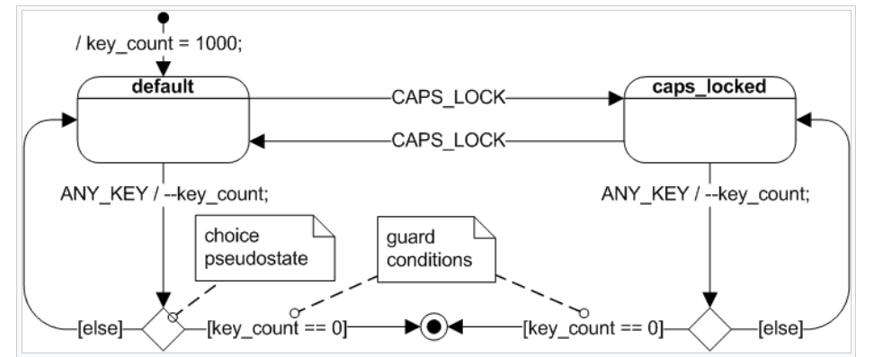
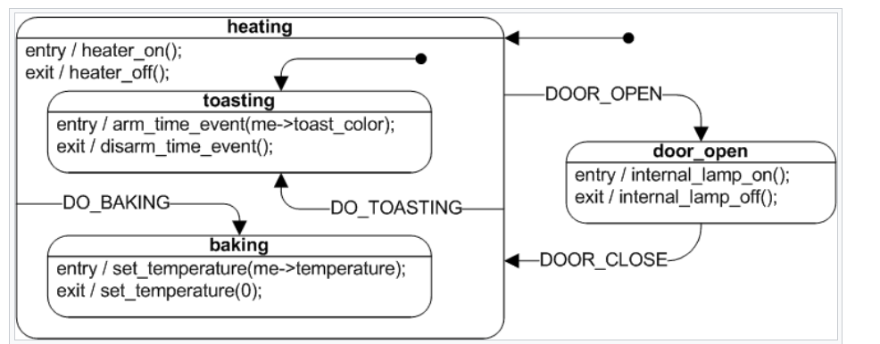

# UML

UML is a modeling language, it's helpful for making simple charts and diagrams to document and visualize design but don't get too deep on it.

## PlantUML

PlantUML allows you to describe your UML diagram using text so it's pretty convenient to check it in to vcs. There is also a vscode extension that is pretty good. The syntax is fairly simple.

## UML state machine

The [Wikipedia page on UML state machine is a really good reference](1)

Below are common notations for quick reference, note that the dashed lines are for comments.

A basic UML diagram, pay attention to the `choice state` and the `event / action` notation:

`Hierarchical State Machine`, pay attention to the `entry` and `exit` function

[1]: https://en.wikipedia.org/wiki/UML_state_machine
